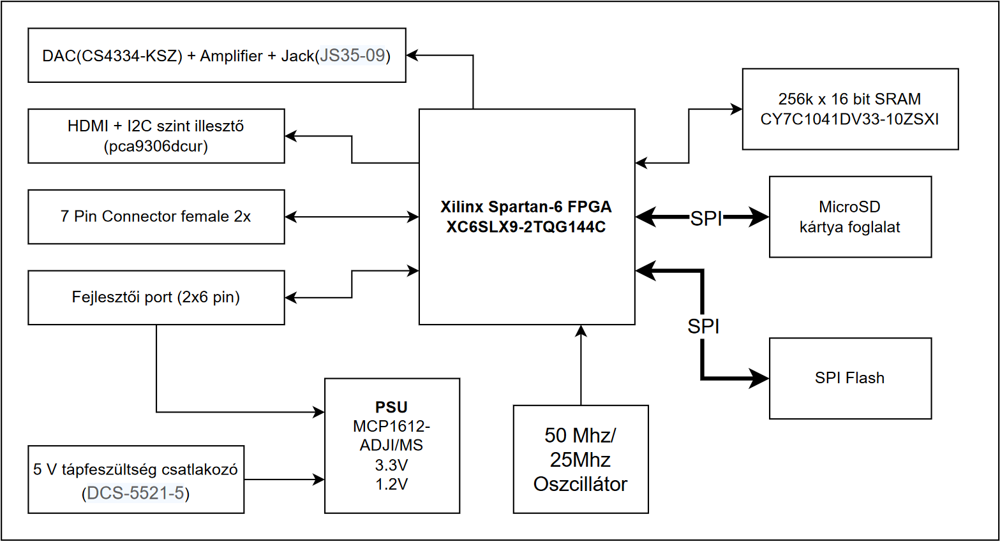
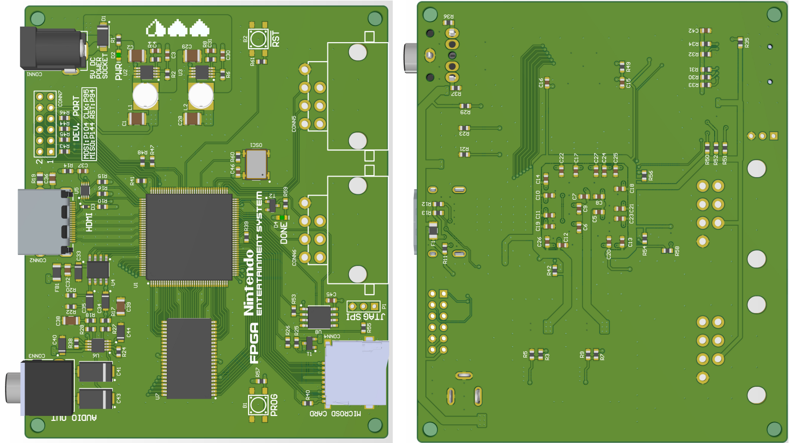

# NESDev

Thesis work.

In my thesis, I re-design the iconic game console Nintendo Entertainment System to modern standards. My project based on the hardware emulation of the NES’s hardware in an FPGA (Xilinx Spartan-
6). 

This is an ongoing project. In my last semester, I designed a two layer PCB, with Altium Designer, where I upgrade the old
hardware, with modern components. I placed an HDMI for VGA rendering, also an on board SRAM (for NES game ROM's). For future improvements I placed an MicroSD card reader (holding more game ROM's). Of course next to these "upgrades" my console have to play the original games.

Moreover I started to work on re-designing the PPU (Picture Process Unit) of the NES. 

In the future I'm going to implement the CPU (6502 8-bit) of the original hardware and the APU (Audio Process Unit) and in the end I will test my hardware with the original games.
This stage of the project have a Hungarian documentation. 
